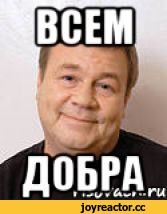

# Заголовок1

## Заголовок2

### Заголовок3

#### Заголовок4

---

Обычный текст vs **Жирный текст**

*Курсив*

***Жирный и курсивный***

~~Зачёркнутый~~

---

- Можно
- Делать
  - Списки
1. По
2. Разному
3. !

---

Оставлять цитаты
>Ладно... ©Жак Фреско

---

Или даже добавлять код

```a = "Hello, world!"```

```print(a)```

---

[Нажми меня](https://tenor.com/ru/view/linux-linux-developer-linux-hacker-hacker-linux-user-gif-25806054)

---



---

| id | name | Три цифры с оборота карты |
|-----|----------|--------|
| 1 | Илон Маск | 891 |
| 2 | Джефф Безос | 777 |

---

- [x] Создать тестовый репозиторий для урока по Markdown
- [x] Описать возможности Markdown
- [ ] Подсидеть Ануара пока он в отпуске

---

<details>
  <summary>Кто лучшая публика?</summary>
  Вы - лучшая публика!
</details>


